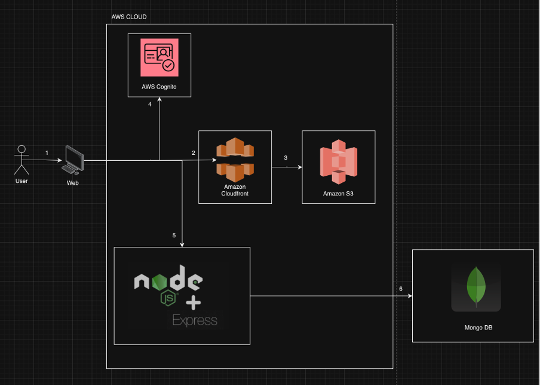

Technology Stack:
    Node.js / Express
    MongoDB Atlas

Local setup / installations:
    1. Install Node to your computer.
    2. Install Git
    3. Clone the repo to your local
    4. Create a .env file in your project directory
    5. Update the MongoDB connection-string in .env file. Checkout the .env.example file for the connection-string format.
    6. npm install
    7. npm start (to run the Nodejs Express API app on local)

Access Application
    Open the browser and open: http://localhost:8080 to launch the application on local

Authentication:
    AWS Cognito

Architecture:
    

Support
    Bhavik Yakkarnall (byakkarnall@gmail.com)